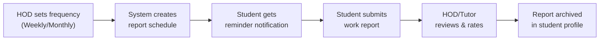

# 📋 Product Requirements Document (PRD)
## Rathinam College — Internship & Placement Portal  
### **"InternFlow"**

| Field | Value |
|-------|-------|
| **Version** | 2.0 |
| **Date** | 10 April 2026 |
| **Author** | Product & Engineering Team |
| **Status** | Draft — Awaiting Review |

---

## 1. Executive Summary

**InternFlow** is a premium, role-based internship and placement management platform for Rathinam College. It digitizes the entire internship lifecycle — from student application, document validation, multi-tier approval, automatic bonafide & OD form generation, post-internship work reporting, to job opportunity management via collaborative company partnerships and alumni referrals.

### Core Differentiators
1. **Smart Document Checklist & Validation** — Guided submission with pre-validation
2. **Smart Analytics Dashboard** — Real-time heatmaps, SLA tracking, Excel export
3. **Unified Admin Tier** — Dean, Placement Officer & Principal share equal full-admin access
4. **Staff Job Posting** — Tutors & HODs post jobs, verified by Admin tier
5. **Automatic OD Form Generation** — On-Duty form auto-generated upon approval
6. **Post-Approval Work Reports** — Students submit weekly/monthly reports, reviewed by HOD
7. **Delayed Approval Alerts** — SLA violations alert ALL stakeholders in the chain
8. **Alumni Referral Portal** — Alumni-driven job referral ecosystem
9. **Collaborative Company Portal** — Companies partner directly with Rathinam's placement cell

---

## 2. Problem Statement

Students at Rathinam College navigate a fragmented, paper-heavy process to secure internship approvals — visiting 5+ offices, carrying physical documents, waiting days for each signature. No centralized tracking, no transparency, no digital audit trail, no post-internship reporting system.

**Key Pain Points:**
- ❌ No visibility into approval status
- ❌ No digital document verification
- ❌ No analytics to identify bottlenecks
- ❌ No centralized job/opportunity board
- ❌ No automated certificate or OD form generation
- ❌ No structured post-internship reporting
- ❌ No mechanism to alert delayed approvals to all stakeholders

---

## 3. Goals & Objectives

| Goal | Metric | Target |
|------|--------|--------|
| Reduce approval turnaround time | Avg days submission → approval | < 5 business days |
| Eliminate paper-based submissions | % digital submissions | 100% |
| Improve student satisfaction | Completion rate | > 90% |
| Enable data-driven administration | Admin dashboard adoption | 100% active weekly |
| Expand opportunity visibility | Job postings per quarter | 50+ |
| Ensure timely approvals | SLA compliance rate | > 95% |
| Track internship outcomes | Work report submission rate | > 90% |

---

## 4. User Roles & Access Model

> [!IMPORTANT]
> **Core RBAC Principle**: Dean, Placement Officer, and Principal have **equal, full administrative access**. No hierarchy between these three — they are co-administrators.

### 4.1 Role Definitions

| Role | Type | Description |
|------|------|-------------|
| **Student** | Internal | Initiates requests, uploads docs, applies to jobs, submits work reports |
| **Tutor** | Internal Staff | 1st-tier approver, can post jobs (requires verification) |
| **HOD** | Internal Staff | 2nd-tier approver, sets report review frequency, can post jobs |
| **Dean** | **Admin** | Full admin — approver, analytics, user mgmt, job verification |
| **Placement Officer** | **Admin** | Full admin — approver, analytics, company collaboration, job verification |
| **Principal** | **Admin** | Full admin — approver, analytics, user mgmt, final authority |
| **Company** | Collaborative Partner | Posts jobs collaboratively with Rathinam, views applicants |
| **Alumni** | External Referral | Posts job referrals via Alumni Referral portal |

### 4.2 Permission Matrix

| Action | Student | Tutor | HOD | Admin (Dean/PO/Principal) | Company | Alumni |
|--------|---------|-------|-----|---------------------------|---------|--------|
| Submit Internship Request | ✅ | ❌ | ❌ | ❌ | ❌ | ❌ |
| Approve Tier 1 | ❌ | ✅ | ❌ | ❌ | ❌ | ❌ |
| Approve Tier 2 | ❌ | ❌ | ✅ | ❌ | ❌ | ❌ |
| Approve Tier 3 | ❌ | ❌ | ❌ | ✅ | ❌ | ❌ |
| View ALL Requests | ❌ | ❌ | ❌ | ✅ | ❌ | ❌ |
| Post Jobs (Direct) | ❌ | ❌ | ❌ | ✅ | ✅ | ✅ |
| Post Jobs (Needs Verification) | ❌ | ✅ | ✅ | ❌ | ❌ | ❌ |
| Verify Staff Job Posts | ❌ | ❌ | ❌ | ✅ | ❌ | ❌ |
| Export Data (Excel) | ❌ | ❌ | ❌ | ✅ | ❌ | ❌ |
| View Analytics | ❌ | ❌ | ❌ | ✅ | ❌ | ❌ |
| Manage Users | ❌ | ❌ | ❌ | ✅ | ❌ | ❌ |
| Submit Work Reports | ✅ | ❌ | ❌ | ❌ | ❌ | ❌ |
| Review Work Reports | ❌ | ✅ | ✅ | ✅ | ❌ | ❌ |
| Set Report Frequency | ❌ | ❌ | ✅ | ✅ | ❌ | ❌ |
| Download Bonafide/OD | ✅ | ❌ | ❌ | ✅ | ❌ | ❌ |
| Receive Delay Alerts | ✅ | ✅ | ✅ | ✅ | ❌ | ❌ |

---

## 5. Feature Specifications

### 5.1 Feature 1 — Smart Document Checklist & Validation

#### 5.1.1 Guided Multi-Step Form

| Step | Name | Fields | Validation |
|------|------|--------|------------|
| 1 | Personal Info | Name, Reg No, Dept, Year, Section | Auto-populated from profile |
| 2 | Internship Details | Company, Address, Role, Duration, Stipend | Required fields with format checks |
| 3 | Document Upload | Offer Letter, Company ID, Parent Consent, Fee Receipt | File type (PDF/JPG), size (< 5MB) |
| 4 | Review & Submit | Summary card of all fields + uploads | Full checklist — all green = can submit |

#### 5.1.2 Checklist Engine
- Auto-validates all inputs before submission
- Items turn ✅/❌ in real-time
- **Submit button disabled** until ALL items pass
- Progress bar shows completion %
- Blocks duplicate active requests for same date range

#### 5.1.3 Approver Summary Card
Pre-validated one-glance card showing student info, internship details, document status, checklist score, and action buttons (Approve/Reject/Clarify).

---

### 5.2 Feature 4 — Smart Analytics Dashboard (Admin)

#### 5.2.1 Dashboard Components

| Component | Type | Description |
|-----------|------|-------------|
| Approval Bottleneck Heatmap | Heatmap | Where requests are stuck (role × department) |
| Avg Approval Time by Role | Bar Chart | Time per tier with SLA violation markers |
| Department-wise Trends | Pie/Bar | Active, approved, rejected per department |
| Company Engagement Score | Ranked List | Top companies by activity |
| Deadline Tracker | Table + Alerts | Students with incomplete approvals near start date |
| SLA Compliance Rate | KPI Card | % completed within 48hr SLA per tier |
| Work Report Compliance | KPI Card | % of students submitting reports on time |

#### 5.2.2 Excel Export (Admin Feature)

> [!IMPORTANT]
> All Admin-tier roles can extract data as **Excel (.xlsx) sheets**.

**Exportable Datasets:**
| Dataset | Columns | Filters |
|---------|---------|---------|
| All Requests | Student, Dept, Company, Status, Dates, Approvers, Duration | Date range, dept, status |
| Approval Logs | Request ID, Approver, Tier, Action, Timestamp, Duration | Date range, role, tier |
| Job Postings | Title, Company, Type, Posted By, Verified By, Applications | Dept, type, status |
| Student Reports | Student, Company, Week/Month, Submitted, Reviewed, Rating | Dept, date range |
| SLA Violations | Request ID, Stuck At, Duration, Approver | Date range, tier |
| Work Report Summary | Dept, On-time %, Avg Rating, Completion Rate | Dept, period |

**Export Options:**
- One-click download from any analytics page
- Scheduled auto-export (weekly/monthly email to admins)
- Custom date range & filter selection before export
- Technology: **SheetJS (xlsx)** for client-side generation

---

### 5.3 Delayed Approval Alerts — ALL Members Notified

> [!WARNING]
> When an approval is delayed, **ALL members in the approval chain** are alerted — not just the current approver.

| Delay | Alert Level | Who Gets Notified | Channel |
|-------|-------------|-------------------|---------|
| 24 hours | 🟡 Warning | Current approver + Student | In-app notification |
| 48 hours | 🟠 Escalation | Current approver + Student + Tutor + HOD + All Admins | In-app + Email |
| 72 hours | 🔴 Critical | ALL chain members + highlighted on Admin dashboard | In-app + Email + Dashboard banner |

**Alert Content Includes:**
- Student name and request details
- Which tier is causing the delay
- How long it has been pending
- Direct link to approve/review

---

### 5.4 Automatic OD (On-Duty) Form Generation

> Upon final approval, the system automatically generates an **OD Form** alongside the Bonafide Certificate.

#### OD Form Contents:
- College letterhead & logo
- Student details (name, register no, department, year, section)
- Internship details (company, role, location)
- Duration (start date → end date)
- "On Duty" designation with dates
- Approved By section with all approver names & designations
- QR verification code (linked to public verification page)
- Auto-generated form number: `RC/OD/2026/[DEPT]/[SERIAL]`

#### Trigger:
- Generated **simultaneously** with bonafide certificate upon Tier 3 approval
- Stored as downloadable PDF on student dashboard
- Emailed to student + tutor + HOD

---

### 5.5 Post-Approval Work Reports

> [!IMPORTANT]
> After approval, students must submit periodic work reports. The **HOD sets the frequency** (weekly or monthly) per department or per student.

#### 5.5.1 Report Submission Flow



#### 5.5.2 Work Report Form

| Field | Type | Required |
|-------|------|----------|
| Report Period | Auto-filled (Week 1, Month 1, etc.) | ✅ |
| Tasks Completed | Rich Text | ✅ |
| Skills Learned | Tag Input | ✅ |
| Challenges Faced | Text | ❌ |
| Hours Worked | Number | ✅ |
| Supervisor Feedback | Text | ❌ |
| Supporting Documents | File Upload | ❌ |

#### 5.5.3 Review by HOD/Tutor
- Rating: 1-5 stars per report
- Comment/feedback field
- "Satisfactory" / "Needs Improvement" / "Excellent" status
- Missed report deadlines are flagged and visible on admin analytics

---

### 5.6 Job Posting by Tutor & HOD (Verified by Admin)

Staff-posted jobs require **verification** by Dean or Placement Officer. Once verified, the listing displays a **"Verified By"** badge showing the admin's name and role.

---

### 5.7 Alumni Referral Portal (Renamed)

> The alumni portal is now called **"Alumni Referral"** — focused specifically on alumni-driven job referrals.

**Features:**
- Alumni post referral opportunities from their professional networks
- Referral posts include: Company, Role, Referral Link, Alumni's endorsement
- Students can apply with a "Referred by [Alumni Name]" tag
- Alumni dashboard shows referral statistics and placement outcomes
- Alumni Referral badge on student profiles who got placed via referrals

**Routes:** `/alumni-referral/*`

| Route | Page |
|-------|------|
| `/alumni-referral` | Alumni Referral Dashboard |
| `/alumni-referral/post` | Post New Referral |
| `/alumni-referral/my-referrals` | Track Referral Outcomes |
| `/alumni-referral/profile` | Alumni Profile |

---

### 5.8 Collaborative Company Portal

> [!NOTE]
> Companies don't operate independently — they **collaborate with Rathinam's placement cell**. Every company action is co-managed.

**Collaborative Model:**
- Companies are onboarded **by the Placement Officer** (not self-registration)
- Job postings by companies are **co-branded** with Rathinam
- Rathinam admins can view and manage all company activities
- Shared applicant pipeline — admins see all company applications
- Company MOU/agreement upload & tracking
- Joint placement drives scheduling

**Company Portal Routes:** `/company/*`

| Route | Page |
|-------|------|
| `/company` | Collaborative Dashboard (co-branded with Rathinam) |
| `/company/post-job` | Post Job (auto-notifies placement cell) |
| `/company/jobs` | Manage Jobs (shared view with admins) |
| `/company/applications` | View Applicants (filterable by admin) |
| `/company/drives` | Scheduled Placement Drives |
| `/company/profile` | Company Profile & MOU |

---

## 6. Internship Approval Workflow

### 6.1 Approval Chain (3-Tier)

Tutor (Tier 1) → HOD (Tier 2) → Admin — any ONE of Dean/Placement Officer/Principal (Tier 3)

### 6.2 Status States

`draft` → `pending_tutor` → `pending_hod` → `pending_admin` → `approved` / `rejected` / `returned`

### 6.3 Post-Approval Auto-Generation
Upon Tier 3 approval:
1. ✅ Bonafide Certificate (PDF)
2. ✅ OD Form (PDF)
3. ✅ Work Report Schedule created (per HOD-set frequency)
4. ✅ Email sent to student with both documents
5. ✅ Student dashboard updated with downloads + report timeline

---

## 7. Database Schema (New & Updated Tables)

### New Tables Added in v2.0

```sql
-- ========================================
-- OD FORMS (Auto-Generated)
-- ========================================
CREATE TABLE od_forms (
  id                UUID PRIMARY KEY DEFAULT gen_random_uuid(),
  request_id        UUID REFERENCES internship_requests(id),
  student_id        UUID REFERENCES users(id),
  form_number       VARCHAR(30) UNIQUE NOT NULL,
  pdf_url           TEXT,
  qr_code           VARCHAR(50) UNIQUE NOT NULL,
  start_date        DATE NOT NULL,
  end_date          DATE NOT NULL,
  is_valid          BOOLEAN DEFAULT true,
  generated_at      TIMESTAMPTZ DEFAULT now()
);

-- ========================================
-- WORK REPORTS (Post-Approval)
-- ========================================
CREATE TABLE work_report_schedules (
  id                UUID PRIMARY KEY DEFAULT gen_random_uuid(),
  request_id        UUID REFERENCES internship_requests(id),
  student_id        UUID REFERENCES users(id),
  frequency         VARCHAR(10) NOT NULL CHECK (frequency IN ('weekly','monthly')),
  set_by            UUID REFERENCES users(id),
  total_periods     INT NOT NULL,
  created_at        TIMESTAMPTZ DEFAULT now()
);

CREATE TABLE work_reports (
  id                UUID PRIMARY KEY DEFAULT gen_random_uuid(),
  schedule_id       UUID REFERENCES work_report_schedules(id),
  student_id        UUID REFERENCES users(id),
  period_number     INT NOT NULL,
  period_label      VARCHAR(50) NOT NULL,
  tasks_completed   TEXT NOT NULL,
  skills_learned    TEXT[],
  challenges        TEXT,
  hours_worked      INT,
  supervisor_feedback TEXT,
  attachment_url    TEXT,
  -- Review
  status            VARCHAR(20) DEFAULT 'pending' CHECK (status IN (
                      'pending','submitted','reviewed','needs_improvement','missed'
                    )),
  reviewed_by       UUID REFERENCES users(id),
  reviewer_role     VARCHAR(20),
  rating            INT CHECK (rating BETWEEN 1 AND 5),
  review_comment    TEXT,
  due_date          DATE NOT NULL,
  submitted_at      TIMESTAMPTZ,
  reviewed_at       TIMESTAMPTZ,
  created_at        TIMESTAMPTZ DEFAULT now()
);

-- ========================================
-- COMPANY COLLABORATION (Updated)
-- ========================================
CREATE TABLE company_profiles (
  id                UUID PRIMARY KEY DEFAULT gen_random_uuid(),
  user_id           UUID REFERENCES users(id) ON DELETE CASCADE,
  company_name      VARCHAR(200) NOT NULL,
  industry          VARCHAR(100),
  website           TEXT,
  logo_url          TEXT,
  description       TEXT,
  mou_url           TEXT,
  mou_valid_until   DATE,
  onboarded_by      UUID REFERENCES users(id),
  partnership_type  VARCHAR(20) CHECK (partnership_type IN ('active','inactive','pending')),
  verified          BOOLEAN DEFAULT false,
  created_at        TIMESTAMPTZ DEFAULT now()
);

-- ========================================
-- ALUMNI REFERRALS (Renamed Portal)
-- ========================================
CREATE TABLE alumni_referrals (
  id                UUID PRIMARY KEY DEFAULT gen_random_uuid(),
  alumni_id         UUID REFERENCES users(id),
  company_name      VARCHAR(200) NOT NULL,
  role_title        VARCHAR(200) NOT NULL,
  description       TEXT,
  referral_link     TEXT,
  endorsement       TEXT,
  target_departments TEXT[],
  deadline          DATE,
  is_active         BOOLEAN DEFAULT true,
  created_at        TIMESTAMPTZ DEFAULT now()
);

-- ========================================
-- DELAYED APPROVAL ALERTS
-- ========================================
CREATE TABLE delay_alerts (
  id                UUID PRIMARY KEY DEFAULT gen_random_uuid(),
  request_id        UUID REFERENCES internship_requests(id),
  alert_level       VARCHAR(10) CHECK (alert_level IN ('warning','escalation','critical')),
  stuck_at_tier     INT NOT NULL,
  stuck_at_role     VARCHAR(20) NOT NULL,
  hours_delayed     INT NOT NULL,
  notified_users    UUID[] NOT NULL,
  created_at        TIMESTAMPTZ DEFAULT now()
);

-- ========================================
-- EXCEL EXPORT LOGS
-- ========================================
CREATE TABLE export_logs (
  id                UUID PRIMARY KEY DEFAULT gen_random_uuid(),
  exported_by       UUID REFERENCES users(id),
  dataset_type      VARCHAR(50) NOT NULL,
  filters_applied   JSONB,
  row_count         INT,
  file_url          TEXT,
  created_at        TIMESTAMPTZ DEFAULT now()
);
```

*(All previously defined tables from v1.0 — users, student_profiles, internship_requests, approval_logs, bonafide_certificates, job_postings, job_applications, request_comments, notifications, email_logs — remain unchanged.)*

---

## 8. Page Structure & Routes

### 8.1 Public Pages
`/` Landing | `/login` Unified Login | `/login/company` Company Login | `/login/alumni-referral` Alumni Login | `/verify/[code]` Certificate/OD Verifier

### 8.2 Student Dashboard (`/student/*`)
Dashboard, New Request (wizard), My Requests, Request Detail, Bonafide & OD Forms, Work Reports (submit), Jobs, Profile

### 8.3 Staff — Tutor & HOD
Approval queue, Request review, Post jobs, My posts, **Work Report Reviews** (HOD sets frequency)

### 8.4 Admin — Dean / Placement Officer / Principal (`/admin/*`)
All requests, Analytics, **Excel Export**, Jobs (verify), Users, Companies, Alumni, Reports, Settings, **Delay Alert Center**, **Work Report Overview**

### 8.5 Company (`/company/*`) — Collaborative
Dashboard (co-branded), Post Job, Manage Jobs, Applications, Placement Drives, Profile & MOU

### 8.6 Alumni Referral (`/alumni-referral/*`)
Dashboard, Post Referral, My Referrals, Profile

---

## 9. UI/UX Design Specification

> [!IMPORTANT]
> This section defines the **premium, modern UI/UX** standards for InternFlow. Every page must feel polished, responsive, and alive.

### 9.1 Design Philosophy

| Principle | Implementation |
|-----------|---------------|
| **Premium Dark-First** | Dark mode as default; togglable light mode. Deep blacks (#0f1117) with blue accents |
| **Glassmorphism** | Frosted glass cards: `backdrop-filter: blur(20px)`, subtle border, low-opacity fills |
| **Depth & Layering** | Multi-layer UI with shadows, z-index hierarchy, floating action buttons |
| **Motion Design** | Every interaction has purposeful animation — no static state changes |
| **Progressive Disclosure** | Show essential info first, expand for details (accordions, slide-outs) |

### 9.2 Skeleton Loading System

> [!NOTE]
> **Every data-dependent component** must show an animated skeleton placeholder while loading. No blank screens, no spinners as primary loading state.

#### Skeleton Components Library

| Component | Skeleton Pattern |
|-----------|-----------------|
| **Dashboard KPI Cards** | 4 rectangular pulse-animated blocks (icon + number + label) |
| **Request List** | 5 rows of shimmer blocks: avatar circle + 3 text lines + status pill |
| **Analytics Charts** | Chart container with animated gradient sweep |
| **User Profile** | Large circle (avatar) + 4 text line blocks + 2 button blocks |
| **Data Tables** | Header row (solid) + 8 shimmer rows with column-width blocks |
| **Job Cards** | Image block + title line + 2 detail lines + tag pills |
| **Work Report Timeline** | Vertical line with 4 circular nodes + text blocks per node |
| **Document Preview** | Large rectangle (document) + filename text + size text |

#### Skeleton Animation Spec
```css
/* Base skeleton shimmer */
.skeleton {
  background: linear-gradient(
    90deg,
    var(--skeleton-base) 25%,
    var(--skeleton-shine) 50%,
    var(--skeleton-base) 75%
  );
  background-size: 200% 100%;
  animation: skeleton-shimmer 1.5s ease-in-out infinite;
  border-radius: 8px;
}

@keyframes skeleton-shimmer {
  0% { background-position: 200% 0; }
  100% { background-position: -200% 0; }
}

/* Dark mode skeleton tokens */
:root[data-theme="dark"] {
  --skeleton-base: rgba(255, 255, 255, 0.05);
  --skeleton-shine: rgba(255, 255, 255, 0.12);
}

/* Light mode skeleton tokens */
:root[data-theme="light"] {
  --skeleton-base: rgba(0, 0, 0, 0.06);
  --skeleton-shine: rgba(0, 0, 0, 0.12);
}
```

### 9.3 Color System — "Rathinam Prestige"

| Token | Light | Dark | Usage |
|-------|-------|------|-------|
| `--primary` | `#1a365d` | `#3182ce` | Buttons, links, headers |
| `--primary-gradient` | — | `linear-gradient(135deg, #3182ce, #805ad5)` | CTAs, hero elements |
| `--accent` | `#d69e2e` | `#ecc94b` | Badges, verification, highlights |
| `--success` | `#38a169` | `#48bb78` | Approved states |
| `--danger` | `#e53e3e` | `#fc8181` | Rejected, errors |
| `--warning` | `#dd6b20` | `#ed8936` | SLA warnings, delays |
| `--bg-primary` | `#f7fafc` | `#0f1117` | Page background |
| `--bg-card` | `#ffffff` | `#1a1d23` | Cards |
| `--bg-elevated` | `#f0f4f8` | `#242830` | Modals, dropdowns |
| `--glass` | `rgba(255,255,255,0.7)` | `rgba(255,255,255,0.06)` | Glass overlays |
| `--border` | `rgba(0,0,0,0.08)` | `rgba(255,255,255,0.08)` | Card borders |

### 9.4 Typography

| Element | Font | Size | Weight |
|---------|------|------|--------|
| H1 (Page Title) | `Outfit` | 32px / 2rem | 700 |
| H2 (Section) | `Outfit` | 24px / 1.5rem | 600 |
| H3 (Card Title) | `Inter` | 18px / 1.125rem | 600 |
| Body | `Inter` | 14px / 0.875rem | 400 |
| Caption | `Inter` | 12px / 0.75rem | 400 |
| Code/Serial | `JetBrains Mono` | 13px / 0.8125rem | 500 |
| KPI Number | `Outfit` | 36px / 2.25rem | 700 |

### 9.5 Component Design Standards

#### Cards
- Border radius: `16px`
- Glass effect: `backdrop-filter: blur(20px)`
- Border: `1px solid var(--border)`
- Shadow (light): `0 4px 24px rgba(0,0,0,0.06)`
- Shadow (dark): `0 4px 24px rgba(0,0,0,0.3)`
- Hover: `translateY(-2px)` + shadow increase

#### Buttons
- Primary: Gradient fill + 12px padding + 10px radius + hover glow
- Secondary: Glass fill + border + hover brightness
- Destructive: Red fill + confirmation modal
- All: `transition: all 0.2s ease`

#### Status Pills
| Status | Style |
|--------|-------|
| Approved | Green bg + white text + ✅ icon |
| Pending | Amber bg + animated pulse dot |
| Rejected | Red bg + white text + ❌ icon |
| Draft | Gray bg + muted text |

#### Tables
- Sticky header with blur background
- Alternating row colors (subtle)
- Hover: row highlight + shadow
- Sortable columns with animated chevrons
- Pagination with smooth page transitions

### 9.6 Animation & Micro-interaction Spec

| Interaction | Animation | Duration |
|-------------|-----------|----------|
| Page transition | Fade + slide up | 300ms ease-out |
| Card hover | Scale(1.01) + shadow | 200ms ease |
| Modal open | Backdrop fade + scale(0.95→1) | 250ms spring |
| Approval action | Confetti burst 🎉 | 1.5s |
| Rejection action | Subtle red pulse on card | 500ms |
| Skeleton → Content | Fade crossover | 400ms ease-in |
| Notification bell | Badge bounce-in | 300ms spring |
| Tab switch | Underline slide | 200ms ease |
| Dropdown | Height expand + fade | 200ms ease |
| Toast notification | Slide in from right + auto dismiss | 300ms in, 5s display |

### 9.7 Responsive Breakpoints

| Breakpoint | Width | Layout |
|------------|-------|--------|
| Mobile | < 640px | Single column, bottom nav, stacked cards |
| Tablet | 640–1024px | 2-column grid, collapsible sidebar |
| Desktop | 1024–1440px | Full sidebar + content area |
| Wide | > 1440px | Max-width container (1440px) centered |

### 9.8 Accessibility
- WCAG 2.1 AA compliance
- Focus ring on all interactive elements
- `prefers-reduced-motion` disables animations
- Keyboard navigable (tab indexing, escape to close)
- ARIA labels on all icons and interactive elements
- Color contrast ratio > 4.5:1 for text

---

## 10. Automated Email System

| Event | Recipients | Template |
|-------|-----------|----------|
| New Request Submitted | Student + Tutor | `request_submitted` |
| Tier 1 Approved | Student + HOD | `tier1_approved` |
| Tier 2 Approved | Student + Admin tier | `tier2_approved` |
| Tier 3 Approved + OD + Bonafide | Student + Tutor + HOD | `fully_approved` |
| Request Rejected | Student | `request_rejected` |
| **Delay Alert (24h)** | Current approver + Student | `delay_warning` |
| **Delay Alert (48h)** | ALL chain members | `delay_escalation` |
| **Delay Alert (72h)** | ALL chain members + Admins | `delay_critical` |
| Work Report Due Reminder | Student | `report_reminder` |
| Work Report Reviewed | Student | `report_reviewed` |
| Work Report Missed | Student + HOD + Tutor | `report_missed` |
| Job Verified | Poster + students | `job_verified` |
| **Excel Export Completed** | Requesting admin | `export_ready` |

---

## 11. Tech Stack

| Layer | Technology | Rationale |
|-------|-----------|-----------| 
| **Framework** | **Next.js 16** (App Router) | Latest SSR, RSC, middleware for RBAC |
| **Language** | TypeScript | Type safety across full stack |
| **Styling** | Vanilla CSS + CSS Custom Properties | Full design control, premium aesthetics |
| **Auth** | Auth.js v5 | Flexible credential + OAuth |
| **Database** | Neon PostgreSQL | Serverless Postgres, branching |
| **ORM** | Drizzle ORM | Type-safe, lightweight |
| **PDF Gen** | jsPDF + html2canvas | Bonafide + OD form generation |
| **Excel Export** | SheetJS (xlsx) | Client-side Excel generation |
| **Charts** | Recharts | Analytics dashboards |
| **Email** | Nodemailer + React Email | Templated transactional emails |
| **File Storage** | Uploadthing / Cloudinary | Document uploads |
| **Validation** | Zod | Schema validation |
| **Hosting** | Vercel | Next.js native platform |
| **Animations** | Framer Motion | Page transitions, micro-animations |
| **Icons** | Lucide React | Clean iconography |
| **Fonts** | Google Fonts (Inter, Outfit, JetBrains Mono) | Premium typography |

---

## 12. Non-Functional Requirements

| Requirement | Target |
|-------------|--------|
| Page Load Time (LCP) | < 1.5 seconds |
| Time to Interactive (TTI) | < 2.5 seconds |
| Uptime | 99.9% |
| **Max Concurrent Users** | **5,000+** |
| File Upload Limit | 5 MB per file |
| Session Timeout | 8 hours (staff), 4 hours (student) |
| Browser Support | Chrome, Firefox, Safari, Edge (latest 2) |
| Accessibility | WCAG 2.1 AA |
| Data Backup | Daily automated + point-in-time recovery |
| Skeleton Loading | All data views must show skeleton states |
| Excel Export | < 5 seconds for up to 10,000 rows |

---

## 13. Phased Build Plan

| Phase | Features | Timeline |
|-------|----------|----------|
| **Phase 1 — Core MVP** | Auth, RBAC, Student wizard, Checklist engine, 3-tier approval, All dashboards with skeleton loading, Modern UI/UX foundation | Sessions 1–3 |
| **Phase 2 — Automation** | Bonafide + OD form auto-gen, Work report system, Staff job posting + verification, Delay alerts to all members, Email system | Sessions 4–5 |
| **Phase 3 — Ecosystem** | Analytics dashboard, Excel export, Alumni Referral portal, Collaborative Company portal, SLA tracking, Reports | Sessions 6–7 |

---

## 14. Success Metrics

| Metric | Baseline | Target (6 months) |
|--------|----------|--------------------|
| Avg approval time | 10–15 days | < 5 days |
| Incomplete doc rejections | ~40% | < 5% |
| Student satisfaction | N/A | > 4.2/5 |
| Admin time per request | ~30 min | < 5 min |
| SLA compliance rate | N/A | > 95% |
| Work report submission rate | N/A | > 90% |
| Job postings/month | 0 | 20+ |

---

> [!TIP]
> **Next Steps**: Review this PRD v2.0 and confirm the scope. Once approved, we begin with Phase 1 — modern UI foundation with skeleton loading, RBAC, and approval workflow.

---

*InternFlow v2.0 — Powering Rathinam's internship ecosystem.* ✨
